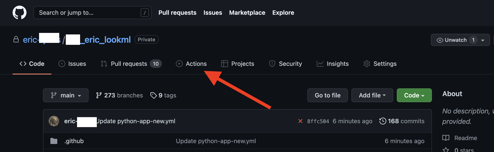
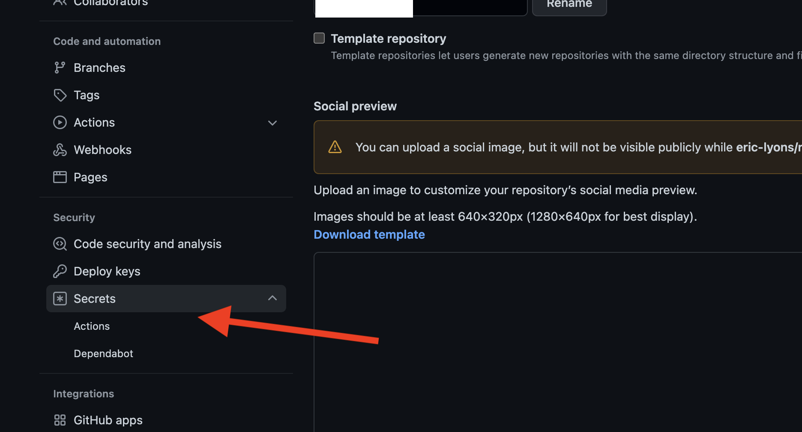
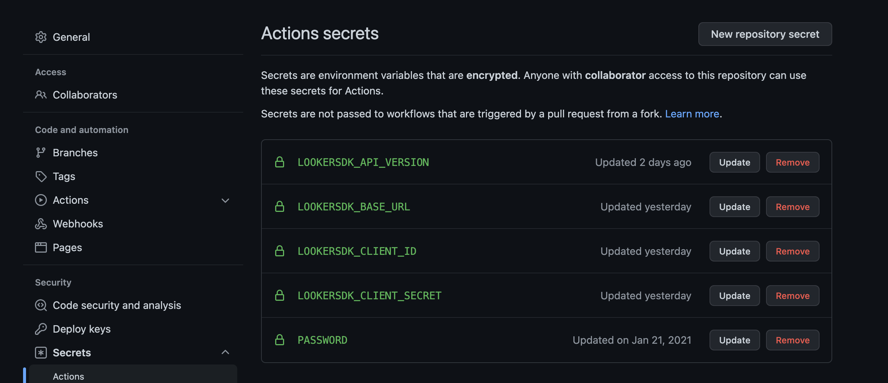
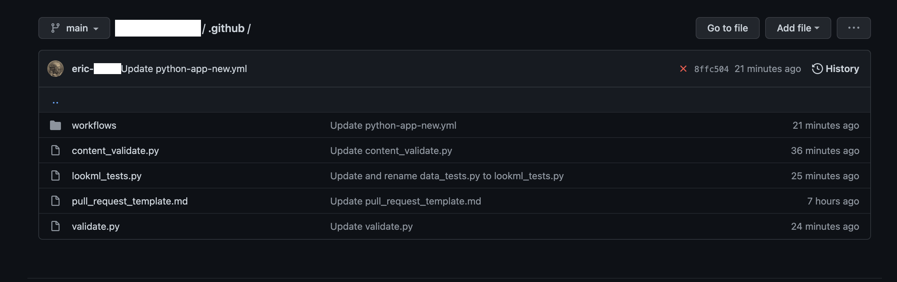
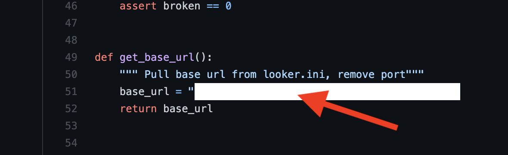
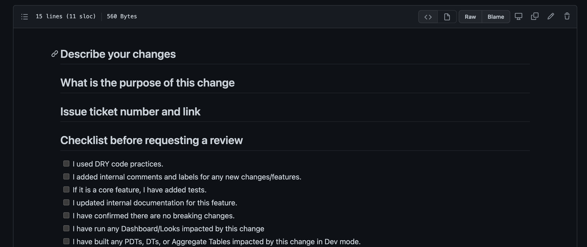
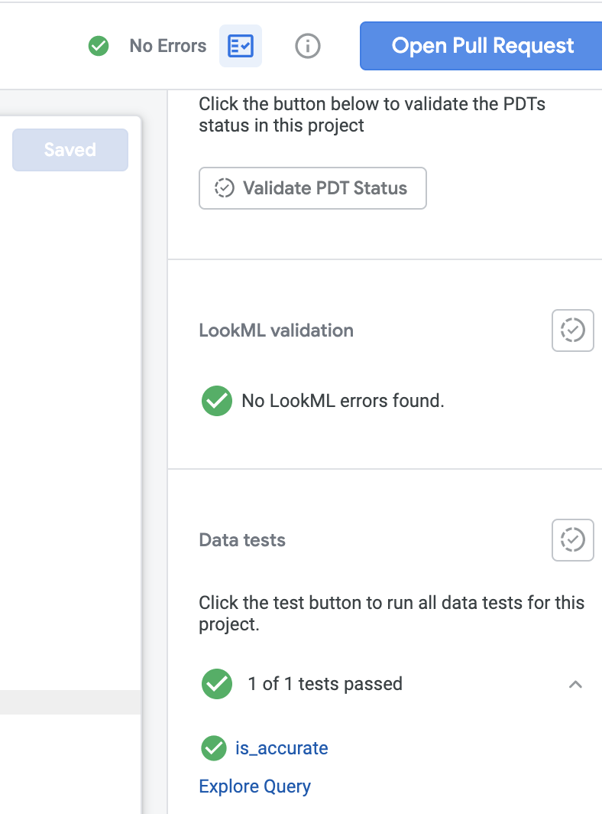
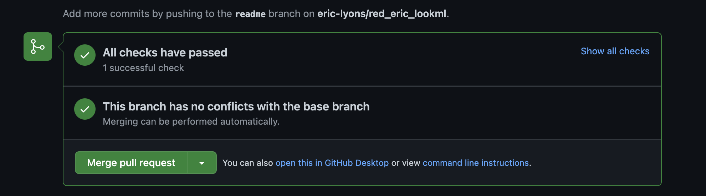
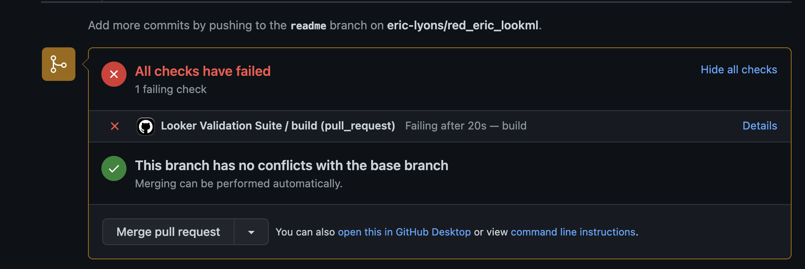

# Working with Github Actions for Looker CI/CD
This doc walks through the process of creating a Github Action. The action will run on push events and pull requests to the main branch. The action will run three scripts. This workflow is a key tenant in promoting code quality and ensuring that your Looker Data team or analysts can focus on creating new features for business users rather than devoting a large portion of time to resolving/fixing broken content. 

The first script will check if there are any Lookml validation errors or warnings. 
The second script will check if the branch the pull request originated from causes an increase in broken content relative to production. This is currently commented out. Depending on the size of your instance and the number of pieces of broken content this can take a while to load. The third script will run all the LookML tests in the project and fail if any of those tests do not pass. 
The first and third script both run in under 50 seconds generally. 

## Steps to enable the Github Action. 

1. Enable [Pull Requests in your LookML Project](https://docs.looker.com/data-modeling/getting-started/git-options). Navigate to project settings and under GitHub Integration toggle on Pull Requests Required. 
2. Add the [deploy webhook to Github](https://help.looker.com/hc/en-us/articles/360001288268-Deploy-Webhook-Pulling-From-Remote-Git-Repository). You can do this by going to the repo settings and selecting webhooks.

3. In your github repo, click actions.

4. Click new workflow.
5. Search for Python Application and click configure. 

6. Name your workflow
7. You can customize the events the action is triggered on. For full reference, see this [site](https://docs.github.com/en/actions/using-workflows/events-that-trigger-workflows):
Or feel free to use this template. Note: This is not supported by Looker's Department of Customer Love. 
8. **If you use the template, be sure to change the project name arg under the run categories to match your project name.**
9. Save these changes. The action will try to run, but will fail. That is OK!
10. Create a service account in the Looker UI. Make this account either a developer or admin. Then, go to admin → users and [generate a client_id and client_secret](https://docs.looker.com/reference/api-and-integration/api-auth). 
11. Next click the settings tab in the github repo and scroll down to secrets. 

12. Create a secret for :
- LOOKERSDK_API_VERSION
- LOOKERSDK_BASE_URL
- LOOKERSDK_CLIENT_ID
- LOOKERSDK_CLIENT_SECRET. 

Make sure these are all capitals. This way the SDK can recognize these as the correct environment variables. 

13. Click the code tab in the repo. Notice the .github directory. Navigate to there. Feel free to upload the three scripts in the example repo. Place these in the root of the .github file. Feel free to create another directory, but you will need to update the run events on your .yml file. Notice the run portions begin with cd .github to navigate to the same directory as the scripts. 

If you use content_validate.py, edit the code to use your own base url on line 51 or feel free to create an arg with arg parse. Then, pass that in via the run portion of the script. 

14. Finally, create a pull_request_template.md file. This will be the markdown file that serves as the template for your pull requests in github. There are many excellent examples online or use the bare bones markdown file located in the example repo. 

## Testing the Action
1. Navigate to your Looker project.
2. Make a change to the code. 
3. Save the change. 
4. Check to see if the LookML validation passes. 
5. Run any LookML tests defined in the project.

6. Click Open Pull Request.

7. Click view pull request.

8. Click details to see the action progress through each step. 

9. If your code has no warnings or errors and all the data tests pass you will be in the green. Feel free to merge your PR. Congrats!

10. Now, to make sure the scripts are working, go back into the LookML project, pull down the latest changes and create a new branch. 
11. Create some code which will cause a warning or error. 
12. Now change the assertion parameter in the LooML tests to be sure to fail.
13. If possible save these changes. You may have the project setting enabled where you cannot commit with errors or warnings (This is a good thing.).

14. Not create a commit with the failed LookML test and the validation errors/warnings. If you just have the LookML test that fails, that is totally fine.
15. Now open a new pull request. 
16. View the PR and notice the checks have failed. 

17. Click details to see the specific reason why they failed. 

## Suggested Workflow
To optimize development efficiency and to maximize the value of your data team, we want to minimize the amount of time working on legacy content or even broken content. The Github action will help automate and add secondary checks to ensure quality. The pull request template allows for tracking and thorough review on the developer’s behalf. The checklist should make the developer critically evaluate his/her/their code. Even though it may pass all the validation checks, what problem does it solve? Is the field easily understood and accessible to the business users? Could it be written in a more efficient manner? These are the questions one must ask to ensure a streamlined data model and to optimize Looker as a data product. 

We would suggest requiring other team members review developer’s pull requests to ensure another pair of eyes reviews the code. We would also want the developer to complete a checklist similar to the one listed in the example pull_request_template.md file. We would also suggest adding LookML tests whenever possible. Some key tests are to check if a primary key is truly unique and to make sure no values of the primary key are null. Finally, we would suggest using the scripts in the repo to add another layer of validation and security. Feel free to customize the scripts or add your own. An extension of this workflow could add a validation script that checks fields for labels, descriptions, and potential column or row level security parameters such as access_filters or required_access_grants. 

## Summary
Congratulations! You have successfully enabled a Github action and added an automation to ensure that your LookML developers adhere to best code practices. You can edit the scripts as needed. Currently, they fail based on a strict assertion statement. They look for any new broken content, any LookML warnings/errors, and any failed LookML tests. 

Automations like this can help reduce the number of bugs pushed in your data stack and improve the accuracy of your code. In combination these make an overall more efficient data stack. This allows your developers to focus on new features or new data models and improves business user trust insofar as it will dramatically reduce the volume of broken content. 

If your team does not use Github actions, you can use a similar approach with tools like Jenkins or Cloud Build. 

